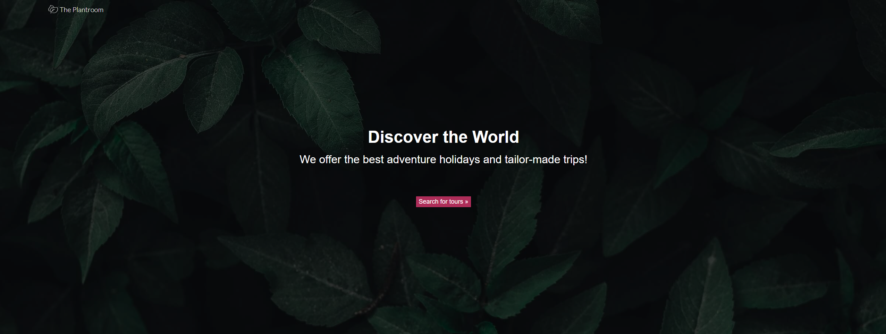

# Contact Form

Um formulário de contato para fins de estudo.

### Ajustes e melhorias

O projeto ainda está em desenvolvimento e as próximas atualizações serão voltadas nas seguintes tarefas:

- [x] Hero image
- [x] Navbar over hero image
- [ ] Image pop-out
- [ ] Footer
- [ ] Tarefa 5

## 💻 Pré-requisitos

O projeto não precisa de instalação, basta apenas clonar e abrir o *index.html*

## 🚀 Instalando <contactform>

O projeto não precisa de instalação, basta apenas clonar e abrir o *index.html*

## 📫 Contribuindo para <contactform>
Para contribuir com <contactform>, siga estas etapas:

1. Bifurque este repositório.
2. Crie um branch: `git checkout -b <nome_branch>`.
3. Faça suas alterações e confirme-as: `git commit -m '<mensagem_commit>'`
4. Envie para o branch original: `git push origin <nome_do_projeto> / <local>`
5. Crie a solicitação de pull.

Como alternativa, consulte a documentação do GitHub em [como criar uma solicitação pull](https://help.github.com/en/github/collaborating-with-issues-and-pull-requests/creating-a-pull-request).

## 📝 Licença

Esse projeto está sob licença. Veja o arquivo [LICENÇA](LICENSE.md) para mais detalhes.

[⬆ Voltar ao topo](#contactform) 
